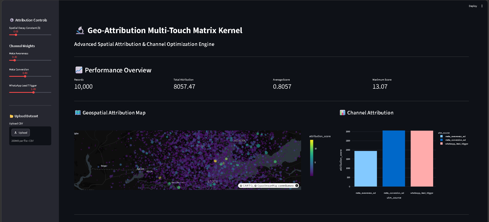

# Geo-Attribution Multi-Touch Matrix Kernel (PROJECT OMNI_GRAPH)

🔬 **Advanced Spatial Attribution & Channel Optimization Engine**

---

## 📊 System Overview



---

## 📈 Executive Overview

Traditional multi-touch attribution models fail to account for physical constraints, leading to massive data loss and misattributed conversions in geographic marketing distribution networks. **PROJECT OMNI_GRAPH** resolves this gap by introducing a **Vectorized Spatial Friction Kernel**. 

By calculating continuous exponential distance-decay factors against discrete multi-channel interaction vectors, this system mathematically evaluates how conversion intent diminishes over physical distance. The engine processes massive datasets instantaneously using an optimized NumPy computational pipeline, visualizes structural density via a dynamic Streamlit web architecture, and exports fully scored attribution matrix frameworks.

---

## 🚀 Key Architectural Highlights

* **Vectorized Processing Engine:** Eliminates sluggish Python `for-loops` in favor of highly optimized contiguous NumPy array operations, achieving instantaneous execution across tens of thousands of coordinates.
* **Geometric Multi-Touch Simulation:** Utilizes a realistic geometric probability distribution ($\gamma = 0.4$) to model consumer behavior, acknowledging that a majority of users engage fewer times, while a small fraction scale to higher touchpoint counts.
* **Dynamic Spatial Friction Layer:** Implements localized decay variables ($\lambda$) to gauge continuous physical friction within target metropolitan boundaries (e.g., Lagos network matrices).
* **Interactive Production Dashboard:** Features an analytical dark-themed interface built using modern Streamlit layouts and Plotly graphics, offering map-level granularity and real-time parameter tuning.

---

## 🔬 Mathematical Architecture

The core calculation platform models localized attribution scores ($A$) per point by processing the interaction frequency vector, user channel assignments, and distance arrays:

$$A = I \cdot W(c) \cdot e^{-\lambda \cdot d}$$

Where:
* $I \in \mathbb{N}^+$ represents the discrete interaction frequency per point (modeled via a geometric distribution).
* $W(c)$ represents the assigned static weight multiplier for marketing channel $c$ (e.g., Meta Awareness, Meta Conversion, WhatsApp Lead Trigger).
* $\lambda$ represents the continuous spatial decay parameter adjusted via the UI control interface.
* $d$ represents the physical distance in kilometers from the corporate business coordinate.

---

## 📂 File Structure & System Layout

```text
Geo_Attribution_Kernel/
│
├── core_logic/
│   └── simulated_touchpoints.csv  # High-density synthetic data store
│
├── assets/
│   └── dashboard_preview.png      # System UI storefront graphic
│
├── generate_data.py               # Advanced geometric simulation generator
├── app.py                         # Unified Streamlit dashboard & engine UI
├── requirements.txt               # Declared software environment parameters
└── README.md                      # Technical whitepaper dossier
